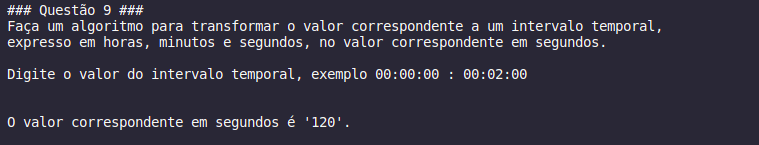

# Exercício de Avaliação: A1F

### Aluno: Messias Wagner da Silva Dias
### Matricula: 600912959
### Curso: Lógica de programação de Algoritmos I
### Professora: Alessanda Fonseca
### Polo: Recife - PE

  

### 1 - Faça um algoritmo para ler e em seguida exibir as seguintes informações de uma pessoa: Nome, Idade, Sexo, Peso, Altura, Profissão, Rua, Bairro, Cidade, Estado, CEP, Telefone. 

### 2 - Faça um algoritmo que informe o nome e idade de duas pessoas. Mostre o nome e idade das duas pessoas na tela.

### 3 - Faça um algoritmo que digite o nome e idade de duas pessoas. Encontre e imprima a diferenças de idades entre as pessoas. E a soma das idades das pessoas.

### 4 - Faça um algoritmo que solicite a idade e o nome de quatro pessoas. Calcule e imprima a média aritmética das idades.

### 5 - Faça um algoritmo para ler dois inteiros (variáveis A e B) e imprimir o resultado do quadrado a diferença do primeiro valor pelo segundo.

### 6 - Faça um algoritmo que leia a descrição do produto, quantidade em estoque e valor unitário do produto. Informe o valor total em produtos existente no estoque.

### 7 - Faça um algoritmo para ler a base e a altura de um triângulo. Em seguida, escreva a área do mesmo.

### 8 - Construa um algoritmo para calcular as raízes de uma equação do 2º grau, sendo que os valores A, B e C são fornecidos pelo usuário.

### 9 - Faça um algoritmo para transformar o valor correspondente a um intervalo temporal,expresso em horas, minutos e segundos, no valor correspondente em segundos.

### 10 - Faça um algoritmo para calcular e imprimir o salário bruto a ser recebido por um funcionário em um mês. Você deverá utilizar os seguintes dados: número de horas que o funcionário trabalhou no mês, valor recebido por hora de trabalho, o valor da contribuição ao INSS, número de dependentes (filhos menores de 14 anos para adicionar o salário família) e o valor do salário família por nº de dependentes.

